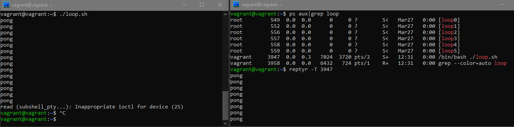

# Работа в терминале. Лекция 2
1. `cd` - встроенная команда оболочки. И делать её внешней наверное, не имеет смысла, т.к. мы меняем "текущий каталог", что есть, по сути, некая внутренняя переменная интерпретатора.


2. Альтернатива без pipe -  `grep -c <some_string> <some_file>`.


3. Процесс с PID 1 - это `/sbin/init`, что в данной системе есть не что иное, как символическая ссылка на systemd (`/lib/systemd/systemd`).


4. Чтобы перенаправить вывод stderr ls на другую сессию терминала, нужно выполнить `ls 2>/dev/pts/N`, где N - номер терминала, принадлежащий нужной сессии. 


5. Это возможно. Например `cat <file1 >file2`


6. Получится, если открыть терминал с правами root, либо если зайти в консоль под тем же пользователем, что и в графической/ssh сессии.
Чтобы увидеть - нужно увидеть консоль :). Т.е. если в графике мы работаем, например, по VNC и смотрим в консольное окно виртуальной машины.


7. Команда bash `5>&1` создаст новый дескриптор потока с номером 5 сдублировав открытый дескриптор stdout. Поэтому, следующая команда `echo netology > /proc/$$/fd/5` приведёт к выводу слова 'netology' на экран. 


8. Получится, используя промежуточный дескриптор. Например, так:
    ```
    vagrant@vagrant:~$ ls /opt /not-a-dir 3>&1 1>&2 2>&3 |tee stderr.log
    /opt:
    VBoxGuestAdditions-6.1.40
    ls: cannot access '/not-a-dir': No such file or directory
    vagrant@vagrant:~$ cat stderr.log
    ls: cannot access '/not-a-dir': No such file or directory
    ```


9. команда `cat /proc/$$/environ` выведет все переменные окружения текущего процесса, имевшиеся на момент его создания.
Аналогичный вывод можно получить при помощи команды `printenv`, но он будет содержать текущее состояние переменных и их значений.


10. По адресу `/proc/<PID>/cmdline` расположена доступная для чтения полная командная строка запуска процесса, а по адресу `/proc/<PID>/exe` - символическая ссылка на исполняемый файл процесса.


11.  Выполняем `grep sse /proc/cpuinfo` :

        ```vagrant@vagrant:~$ grep sse /proc/cpuinfo
        flags           : fpu vme de pse tsc msr pae mce cx8 apic sep mtrr pge mca cmov pat pse36 clflush mmx fxsr sse sse2 ht syscall nx rdtscp lm constant_tsc rep_good nopl xtopology nonstop_tsc cpuid tsc_known_freq pni pclmulqdq ssse3 cx16 pcid
        sse4_1 sse4_2 x2apic movbe popcnt aes xsave avx rdrand hypervisor lahf_lm abm invpcid_single pti fsgsbase avx2 invpcid md_clear flush_l1d
        ```
Видим, что максимальная поддерживаемая версия SSE - SSE4.2.

12. Это происходит потому, что при запуске в режиме выполнения команд на удалённом хосте, ssh по умолчанию терминал не выделяет. Чтобы изменить поведение, нужно запустить ssh с ключом `-t`:
    ```
    vagrant@vagrant:~$ ssh -t localhost tty
    vagrant@localhost's password:
    /dev/pts/2
    Connection to localhost closed.
    ```
13. Устанавливаем `reptyr`, в одном терминале запускаем простенький скрипт, который периодически выводит текст на экран, в другом перехватываем. Работает:
    

14. Команда `tee` предназначена для чтения стандартного потока ввода stdin и вывода данных в stdout с возможностью копирования в файл. В отличие от встроенной команды `echo`, она является внешней программой, поэтому может быть запущена от имени другого пользователя через `sudo`.