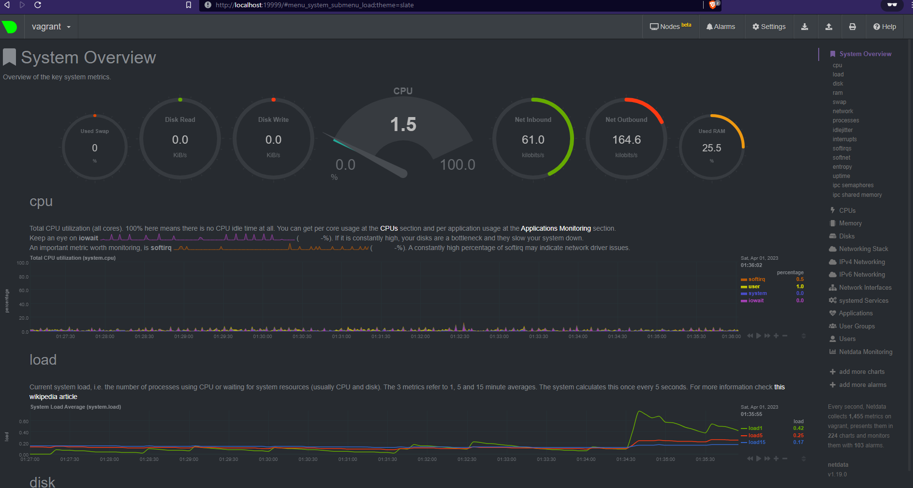

### Операционные системы. Лекция 1
1. Создаём минимальный [unit-файл](node_exporter.service) для сервиса. 
Копируем, активируем, проверяем, что служба запустилась и работает:
    ```
    vagrant@vagrant:~$ sudo cp node_exporter.service /etc/systemd/system
    vagrant@vagrant:~$ sudo systemctl daemon-reload
    vagrant@vagrant:~$ sudo systemctl enable --now node_exporter
    Created symlink /etc/systemd/system/multi-user.target.wants/node_exporter.service → /etc/systemd/system/node_exporter.service.
    vagrant@vagrant:~$ sudo systemctl status node_exporter
    ● node_exporter.service - Prometheus Node Exporter
         Loaded: loaded (/etc/systemd/system/node_exporter.service; enabled; vendor preset: enabled)
         Active: active (running) since Fri 2023-03-31 21:57:59 UTC; 4s ago
       Main PID: 7620 (node_exporter)
          Tasks: 5 (limit: 1065)
         Memory: 2.9M
         CGroup: /system.slice/node_exporter.service
                 └─7620 /usr/local/bin/node_exporter
    
    Mar 31 21:57:59 vagrant node_exporter[7620]: ts=2023-03-31T21:57:59.863Z caller=node_exporter.go:117 level=info collector=thermal_zone
    Mar 31 21:57:59 vagrant node_exporter[7620]: ts=2023-03-31T21:57:59.864Z caller=node_exporter.go:117 level=info collector=time
    Mar 31 21:57:59 vagrant node_exporter[7620]: ts=2023-03-31T21:57:59.864Z caller=node_exporter.go:117 level=info collector=timex
    Mar 31 21:57:59 vagrant node_exporter[7620]: ts=2023-03-31T21:57:59.864Z caller=node_exporter.go:117 level=info collector=udp_queues
    Mar 31 21:57:59 vagrant node_exporter[7620]: ts=2023-03-31T21:57:59.864Z caller=node_exporter.go:117 level=info collector=uname
    Mar 31 21:57:59 vagrant node_exporter[7620]: ts=2023-03-31T21:57:59.864Z caller=node_exporter.go:117 level=info collector=vmstat
    Mar 31 21:57:59 vagrant node_exporter[7620]: ts=2023-03-31T21:57:59.864Z caller=node_exporter.go:117 level=info collector=xfs
    Mar 31 21:57:59 vagrant node_exporter[7620]: ts=2023-03-31T21:57:59.864Z caller=node_exporter.go:117 level=info collector=zfs
    Mar 31 21:57:59 vagrant node_exporter[7620]: ts=2023-03-31T21:57:59.865Z caller=tls_config.go:232 level=info msg="Listening on" address=[::]:9100
    Mar 31 21:57:59 vagrant node_exporter[7620]: ts=2023-03-31T21:57:59.865Z caller=tls_config.go:235 level=info msg="TLS is disabled." http2=false address=[::]:9100
    ```
2. Для базового мониторинга linux-машины можно выбрать приблизительно следующий набор метрик:
    - CPU:
      - node_cpu_seconds_total* (idle, user, system) 
    - RAM:
      - node_memory_MemTotal_bytes
      - node_memory_MemFree_bytes
      - node_memory_MemAvailable_bytes 
    - Диск / ФС:
      - Диск
        - node_disk_read_bytes_total
        - node_disk_written_bytes_total
        - node_disk_io_time_seconds_total
        - node_disk_io_time_weighted_seconds_total
        - Если мониторим физическую машину - Обязательно SMART/контроль за дисковым контроллером
      - ФС  
        - node_filesystem_avail_bytes
        - node_filesystem_files_free
    - Сеть:
      - node_network_up
      - node_network_carrier_changes_total
      - node_network_transmit_errs_total
      - node_network_receive_bytes_total
      - node_network_transmit_bytes_total
3. Установили и запустили Netdata. Работает:

4. Можно. Есть несколько мест, где ядро и systemd сообщают об этом:
    ```
    root@vagrant:/home/vagrant# dmesg|grep virt
    [    0.001995] CPU MTRRs all blank - virtualized system.
    [    0.126797] Booting paravirtualized kernel on KVM
    [    5.248131] systemd[1]: Detected virtualization oracle.
    ```
5. В нашей системе значение fs.nr_open = 1048576: 
    ```
    root@vagrant:/home/vagrant# sysctl fs.nr_open
    fs.nr_open = 1048576
    ``` 
    Но, кроме него ещё существует "мягкий" лимит оболочки на количество открытых файлов, который по умолчанию гораздо меньше:
    ```
    root@vagrant:/home/vagrant# ulimit -n
    1024
    ```
6. В одном сеансе выполняем `unshare -f -p --mount-proc sleep 1h`. В другом - заходим в созданный namespace.
Выясняем pid процесса sleep: 
    ```
    root@vagrant:/home/vagrant# ps aux|grep sleep
    root        3713  0.0  0.0   5480   580 pts/1    S+   10:03   0:00 unshare -f -p --mount-proc sleep 1h
    root        3714  0.0  0.0   5476   516 pts/1    S+   10:03   0:00 sleep 1h
    ```
    Выполняем nsenter и убеждаемся, что наш процесс имеет pid=1:
    ```
    root@vagrant:/home/vagrant# nsenter --target 3714 --pid --mount
    root@vagrant:/# ps aux
    USER         PID %CPU %MEM    VSZ   RSS TTY      STAT START   TIME COMMAND
    root           1  0.0  0.0   5476   516 pts/1    S+   10:03   0:00 sleep 1h
    root           2  0.0  0.4   7236  4132 pts/2    S    10:06   0:00 -bash
    root          13  0.0  0.3   8888  3324 pts/2    R+   10:06   0:00 ps aux
    ```
7. Выражение `:(){ :|:& };:` является т.н. fork-бомбой - функцией, порождающей бесконечное количество процессов с копией себя.
В результате её выполнения в системе могут закончиться ресурсы - либо лимит на количество запущенных процессов, либо память.
Однако, в реальной современной системе её работа достаточно быстро ограничивается, и в выводе `dmesg` можно увидеть следующее сообщение
    ```
    [43233.297181] cgroup: fork rejected by pids controller in /user.slice/user-1000.slice/session-7.scope
    ```
    говорящее о том, что cgroup заблокировал создание новых процессов. Максимальное число процессов задаётся параметром systemd `TasksMax`. 
    его значение можно увидеть в поле `Tasks`, вызвав команду `systemctl status user.slice`:
    ```
    root@vagrant:/etc/systemd# systemctl status user-1000.slice
    ● user-1000.slice - User Slice of UID 1000
         Loaded: loaded
        Drop-In: /usr/lib/systemd/system/user-.slice.d
                 └─10-defaults.conf
         Active: active since Fri 2023-03-31 22:19:09 UTC; 12h ago
           Docs: man:user@.service(5)
          Tasks: 22 (limit: 2344)
         Memory: 48.5M
         CGroup: /user.slice/user-1000.slice
                 ├─session-23.scope
                 │ ├─ 3715 sshd: vagrant [priv]
                 │ ├─ 3773 sshd: vagrant@pts/2
                 │ ├─ 3775 -bash
                 │ ├─ 3808 sudo su
                 │ ├─ 3809 su
                 │ ├─ 3811 bash
                 │ ├─15133 mc
                 │ ├─15139 bash -rcfile .bashrc
                 │ ├─15304 systemctl status user-1000.slice
                 │ └─15305 pager
    ```
    Глобально значение можно регулировать параметром `DefaultTasksMax` в файле `/etc/systemd/system.conf`.