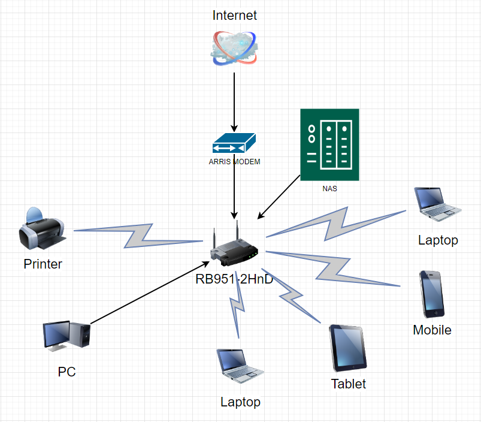

###  Компьютерные сети. Лекция 3
1. Подключаемся к маршрутизатору и смотрим информацию про свой IP: 
    ```commandline
    vagrant@vagrant:/etc$ telnet route-views.routeviews.org
    Trying 128.223.51.103...
    Connected to route-views.routeviews.org.
    Escape character is '^]'.
    C
    **********************************************************************
    
                        RouteViews BGP Route Viewer
                        route-views.routeviews.org
    
     route views data is archived on http://archive.routeviews.org
    
     This hardware is part of a grant by the NSF.
     Please contact help@routeviews.org if you have questions, or
     if you wish to contribute your view.
    
     This router has views of full routing tables from several ASes.
     The list of peers is located at http://www.routeviews.org/peers
     in route-views.oregon-ix.net.txt
    
     NOTE: The hardware was upgraded in August 2014.  If you are seeing
     the error message, "no default Kerberos realm", you may want to
     in Mac OS X add "default unset autologin" to your ~/.telnetrc
    
     To login, use the username "rviews".
    
     **********************************************************************
    
    User Access Verification
    
    Username: rviews
    route-views>show ip route 178.66.156.96
    Routing entry for 178.66.0.0/16
      Known via "bgp 6447", distance 20, metric 0
      Tag 2497, type external
      Last update from 202.232.0.2 4w1d ago
      Routing Descriptor Blocks:
      * 202.232.0.2, from 202.232.0.2, 4w1d ago
          Route metric is 0, traffic share count is 1
          AS Hops 2
          Route tag 2497
          MPLS label: none
    ```
    Информация по BGP:
    ```commandline
    route-views>show bgp 178.66.156.96
    BGP routing table entry for 178.66.0.0/16, version 2752622902
    Paths: (20 available, best #19, table default)
      Not advertised to any peer
      Refresh Epoch 1
      3267 12389, (aggregated by 12389 212.48.198.56)
        194.85.40.15 from 194.85.40.15 (185.141.126.1)
          Origin IGP, metric 0, localpref 100, valid, external
          path 7FE025446D90 RPKI State valid
          rx pathid: 0, tx pathid: 0
      Refresh Epoch 1
      7018 3356 12389, (aggregated by 12389 212.48.198.56)
        12.0.1.63 from 12.0.1.63 (12.0.1.63)
          Origin IGP, localpref 100, valid, external
          Community: 7018:5000 7018:37232
          path 7FE15ED416D0 RPKI State valid
          rx pathid: 0, tx pathid: 0
      Refresh Epoch 1
      8283 1299 12389, (aggregated by 12389 212.48.198.56)
        94.142.247.3 from 94.142.247.3 (94.142.247.3)
          Origin IGP, metric 0, localpref 100, valid, external
          Community: 1299:30000 8283:1 8283:101 8283:102
          unknown transitive attribute: flag 0xE0 type 0x20 length 0x24
            value 0000 205B 0000 0000 0000 0001 0000 205B
                  0000 0005 0000 0001 0000 205B 0000 0005
                  0000 0002
          path 7FE0F6BE0728 RPKI State valid
          rx pathid: 0, tx pathid: 0
      Refresh Epoch 1
      3549 3356 12389, (aggregated by 12389 212.48.198.56)
        208.51.134.254 from 208.51.134.254 (67.16.168.191)
          Origin IGP, metric 0, localpref 100, valid, external
          Community: 3356:2 3356:22 3356:100 3356:123 3356:501 3356:901 3356:2065 3549:2581 3549:30840
          path 7FE103F24468 RPKI State valid
          rx pathid: 0, tx pathid: 0
      Refresh Epoch 1
      20912 3257 1299 12389, (aggregated by 12389 212.48.198.56)
        212.66.96.126 from 212.66.96.126 (212.66.96.126)
          Origin IGP, localpref 100, valid, external
          Community: 3257:8066 3257:30055 3257:50001 3257:53900 3257:53902 20912:65004
          path 7FE029268D50 RPKI State valid
          rx pathid: 0, tx pathid: 0
      Refresh Epoch 1
      20130 6939 12389, (aggregated by 12389 212.48.198.56)
        140.192.8.16 from 140.192.8.16 (140.192.8.16)
          Origin IGP, localpref 100, valid, external
          path 7FE10D4C1F08 RPKI State valid
          rx pathid: 0, tx pathid: 0
      Refresh Epoch 1
      3356 12389, (aggregated by 12389 212.48.198.56)
        4.68.4.46 from 4.68.4.46 (4.69.184.201)
          Origin IGP, metric 0, localpref 100, valid, external
          Community: 3356:2 3356:22 3356:100 3356:123 3356:501 3356:901 3356:2065
          path 7FE0A47C61B0 RPKI State valid
          rx pathid: 0, tx pathid: 0
      Refresh Epoch 1
      852 3356 12389, (aggregated by 12389 212.48.198.56)
        154.11.12.212 from 154.11.12.212 (96.1.209.43)
          Origin IGP, metric 0, localpref 100, valid, external
          path 7FE11C28A448 RPKI State valid
          rx pathid: 0, tx pathid: 0
    ```
2. Добавим параметры и загрузим модуль `dummy`:
    ```commandline
    root@vagrant:/etc#echo "options dummy numdummies=2" > /etc/modprobe.d/dummy.conf
    root@vagrant:/etc# modprobe dummy
    ```
    Добавим конфигурацию интерфейса `dummy0` в `/etc/network/interfaces`:
    ```commandline
    root@vagrant:/etc# cat /etc/network/interfaces
    auto dummy0
    iface dummy0 inet static
    address 10.1.1.1/32
    pre-up ip link add dummy0 type dummy
    post-down ip link del dummy0
    ```
    Запустим интерфейс и добавим несколько маршрутов:
    ```commandline
    root@vagrant:/etc# ifup dummy0
    root@vagrant:/etc# ip -br addr
    lo               UNKNOWN        127.0.0.1/8 ::1/128
    eth0             UP             10.0.2.15/24 fe80::a00:27ff:fe59:cb31/64
    dummy0           UNKNOWN        10.1.1.1/32 fe80::fc19:30ff:feef:7002/64
    ```
    Добавим маршруты и проверим:
    ```commandline
    root@vagrant:/etc# ip route add 10.10.10.0/24 via 10.1.1.1
    root@vagrant:/etc# ip route add 10.10.20.0/24 via 10.1.1.1
    root@vagrant:/etc# ip route add 10.10.30.0/24 via 10.1.1.1
    root@vagrant:/etc# ip route
    default via 10.0.2.2 dev eth0 proto dhcp src 10.0.2.15 metric 100
    10.0.2.0/24 dev eth0 proto kernel scope link src 10.0.2.15
    10.0.2.2 dev eth0 proto dhcp scope link src 10.0.2.15 metric 100
    10.10.10.0/24 via 10.1.1.1 dev dummy0
    10.10.20.0/24 via 10.1.1.1 dev dummy0
    10.10.30.0/24 via 10.1.1.1 dev dummy0
    ```
3. Смотрим открытые ТСР-порты:
    ```commandline
    root@vagrant:/etc# ss -l -n -t -p
    State               Recv-Q              Send-Q                           Local Address:Port                            Peer Address:Port              Process
    LISTEN              0                   4096                             127.0.0.53%lo:53                                   0.0.0.0:*                  users:(("systemd-resolve",pid=620,fd=13))
    LISTEN              0                   128                                    0.0.0.0:22                                   0.0.0.0:*                  users:(("sshd",pid=707,fd=3))
    LISTEN              0                   4096                                 127.0.0.1:8125                                 0.0.0.0:*                  users:(("netdata",pid=642,fd=35))
    LISTEN              0                   4096                                   0.0.0.0:19999                                0.0.0.0:*                  users:(("netdata",pid=642,fd=4))
    LISTEN              0                   4096                                         *:9100                                       *:*                  users:(("node_exporter",pid=644,fd=3))
    LISTEN              0                   128                                       [::]:22                                      [::]:*                  users:(("sshd",pid=707,fd=4))
    ```
    На чистой системе их не много. Это локальный DNS-proxy (`systemd-resolved`) на порту 53, sshd на порту 22 и оставшиеся с предыдущих заданий netdata и node_exporter, живущие на нестандартных портах, но использующие протокол HTTP.
4. Смотрим открытые UDP-порты:
    ```commandline
    root@vagrant:/etc# ss -l -n -u -p
    State               Recv-Q              Send-Q                            Local Address:Port                           Peer Address:Port              Process
    UNCONN              0                   0                                 127.0.0.53%lo:53                                  0.0.0.0:*                  users:(("systemd-resolve",pid=620,fd=12))
    UNCONN              0                   0                                10.0.2.15%eth0:68                                  0.0.0.0:*                  users:(("systemd-network",pid=618,fd=15))
    UNCONN              0                   0                                     127.0.0.1:8125                                0.0.0.0:*                  users:(("netdata",pid=642,fd=33))
    ```
    Их ещё меньше. Это опять DNS-proxy на порту 53, DHCP-клиент на порту 68 и ещё netdata.
5. Домашняя сеть выгядит примерно [так](home.drawio):
