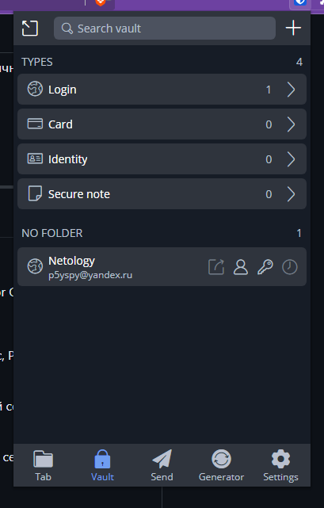
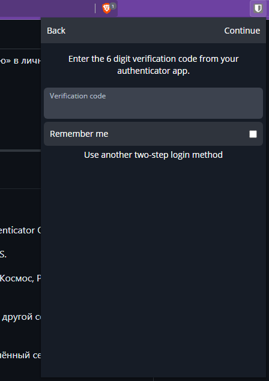
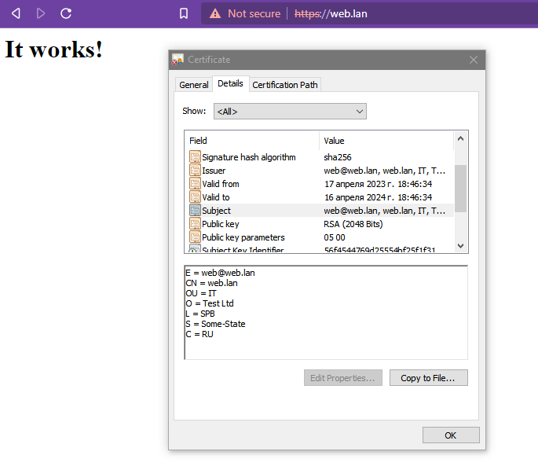
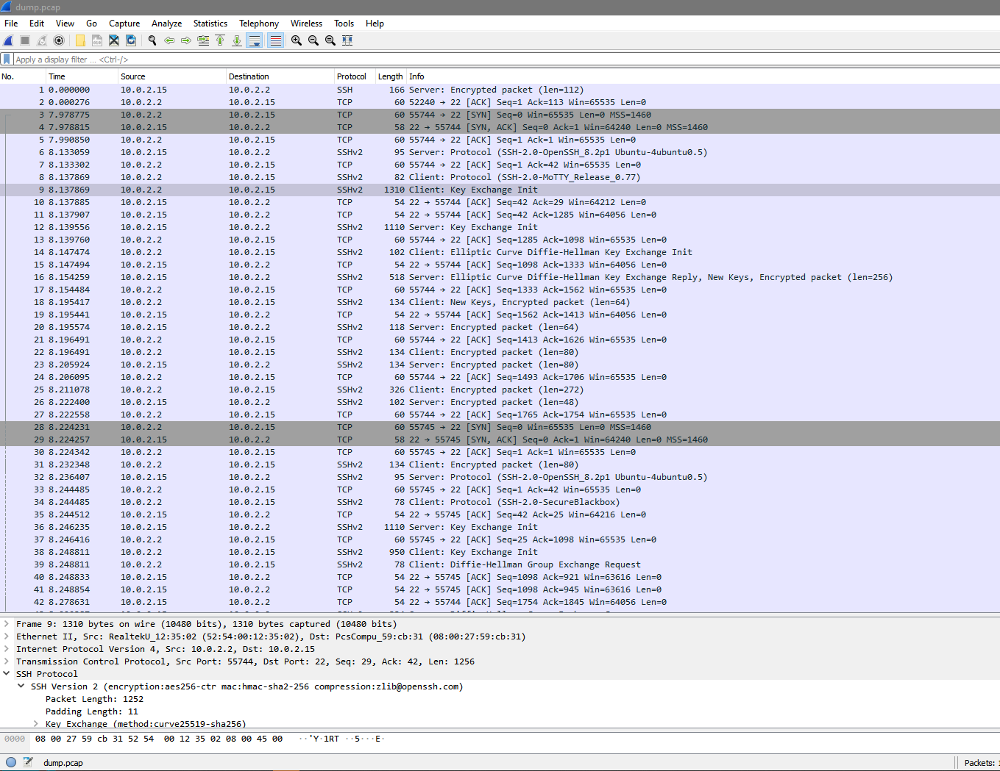

###  Компьютерные сети. Лекция 3
1. Поcтавили плагин, добавили пароль:




3. Добавляем OTP. Гугла в телефоне не держим, используем Aegis. Теперь при входе у нас требуют код:



3. Генерируем самоподписанный сертификат: 
    ```commandline
    root@web:/etc/apache2/sites-available# openssl req -x509 -nodes -days 365 -newkey rsa:2048 -keyout /etc/ssl/private/apache-selfsigned.key -out /etc/ssl/certs/apache-selfsigned.crt
    Generating a RSA private key
    ........................................................................+++++
    .............................+++++
    writing new private key to '/etc/ssl/private/apache-selfsigned.key'
    -----
    You are about to be asked to enter information that will be incorporated
    into your certificate request.
    What you are about to enter is what is called a Distinguished Name or a DN.
    There are quite a few fields but you can leave some blank
    For some fields there will be a default value,
    If you enter '.', the field will be left blank.
    -----
    Country Name (2 letter code) [AU]:RU
    State or Province Name (full name) [Some-State]:
    Locality Name (eg, city) []:SPB
    Organization Name (eg, company) [Internet Widgits Pty Ltd]:Test Ltd
    Organizational Unit Name (eg, section) []:IT
    Common Name (e.g. server FQDN or YOUR name) []:web.lan
    Email Address []:web@web.lan
    
    ```
    Ставим `apache`  и включаем mod_ssl: 
    ```commandline
    apt install apache2
    a2enmod ssl
    
    ```
    Создаём конфиг `/etc/apache2/sites-available/web.lan.conf` для тестового сайта:
    ```shell
    <VirtualHost *:443>
       ServerName web.lan
       DocumentRoot /var/www/web.lan
    
       SSLEngine on
       SSLCertificateFile /etc/ssl/certs/apache-selfsigned.crt
       SSLCertificateKeyFile /etc/ssl/private/apache-selfsigned.key
    </VirtualHost>
    ```
    Включаем его и перезагружаем конфигурацию apache:
    ```commandline
    root@web:/var/www/web.lan# mkdir /var/www/web.lan
    root@web:/var/www/web.lan# echo "<h1>It works!<h1>" >/var/www/web.lan/index.html 
    root@web:/var/www/web.lan# a2ensite web.lan
    Enabling site web.lan.
    To activate the new configuration, you need to run:
          systemctl reload apache2
    root@web:/var/www/web.lan#  systemctl reload apache2
    ```
    Оно работает:


   
4. Ставим `testssl` и проверяем что-нибудь. Например https://www.ssllabs.com :)
   ```commandline
   vagrant@vagrant:~$ git clone --depth 1 https://github.com/drwetter/testssl.sh.git
   Cloning into 'testssl.sh'...
   remote: Enumerating objects: 104, done.
   remote: Counting objects: 100% (104/104), done.
   remote: Compressing objects: 100% (100/100), done.
   remote: Total 104 (delta 14), reused 33 (delta 4), pack-reused 0
   Receiving objects: 100% (104/104), 8.71 MiB | 9.18 MiB/s, done.
   Resolving deltas: 100% (14/14), done.
   vagrant@vagrant:~$ cd testssl.sh/
   
   vagrant@vagrant:~/testssl.sh$ ./testssl.sh -U --sneaky https://ssllabs.com
   
   ###########################################################
       testssl.sh       3.2rc2 from https://testssl.sh/dev/
       (aa5235e 2023-04-01 09:51:27)
   
         This program is free software. Distribution and
                modification under GPLv2 permitted.
         USAGE w/o ANY WARRANTY. USE IT AT YOUR OWN RISK!
   
          Please file bugs @ https://testssl.sh/bugs/
   
   ###########################################################
   
    Using "OpenSSL 1.0.2-bad (1.0.2k-dev)" [~183 ciphers]
    on vagrant:./bin/openssl.Linux.x86_64
    (built: "Sep  1 14:03:44 2022", platform: "linux-x86_64")
   
   
    Start 2023-04-17 16:31:48                -->> 64.41.200.100:443 (ssllabs.com) <<--
   
    rDNS (64.41.200.100):   staging.ssllabs.com. ssllabs.com. www.ssllabs.com. plaintext.ssllabs.com.
    Service detected:       HTTP
   
   
    Testing vulnerabilities
   
    Heartbleed (CVE-2014-0160)                not vulnerable (OK), no heartbeat extension
    CCS (CVE-2014-0224)                       not vulnerable (OK)
    Ticketbleed (CVE-2016-9244), experiment.  not vulnerable (OK)
    ROBOT                                     Server does not support any cipher suites that use RSA key transport
    Secure Renegotiation (RFC 5746)           supported (OK)
    Secure Client-Initiated Renegotiation     not vulnerable (OK)
    CRIME, TLS (CVE-2012-4929)                not vulnerable (OK)
    BREACH (CVE-2013-3587)                    no gzip/deflate/compress/br HTTP compression (OK)  - only supplied "/" tested
    POODLE, SSL (CVE-2014-3566)               not vulnerable (OK)
    TLS_FALLBACK_SCSV (RFC 7507)              No fallback possible (OK), no protocol below TLS 1.2 offered
    SWEET32 (CVE-2016-2183, CVE-2016-6329)    not vulnerable (OK)
    FREAK (CVE-2015-0204)                     not vulnerable (OK)
    DROWN (CVE-2016-0800, CVE-2016-0703)      not vulnerable on this host and port (OK)
                                              make sure you don't use this certificate elsewhere with SSLv2 enabled services, see
                                              https://search.censys.io/search?resource=hosts&virtual_hosts=INCLUDE&q=EDB3A1D6C937E9F01A3E950872EEF2A82B4D1AC55DE8803234FF93D3532E2215
    LOGJAM (CVE-2015-4000), experimental      common prime with 2048 bits detected: RFC3526/Oakley Group 14 (2048 bits),
                                              but no DH EXPORT ciphers
    BEAST (CVE-2011-3389)                     not vulnerable (OK), no SSL3 or TLS1
    LUCKY13 (CVE-2013-0169), experimental     potentially VULNERABLE, uses cipher block chaining (CBC) ciphers with TLS. Check patches
    Winshock (CVE-2014-6321), experimental    not vulnerable (OK)
    RC4 (CVE-2013-2566, CVE-2015-2808)        no RC4 ciphers detected (OK)
   
   
    Done 2023-04-17 16:32:41 [  56s] -->> 64.41.200.100:443 (ssllabs.com) <<--
   ```
5. Создаём новый ключ. 
   ```commandline
   vagrant@vagrant:~/testssl.sh$ ssh-keygen
   Generating public/private rsa key pair.
   Enter file in which to save the key (/home/vagrant/.ssh/id_rsa):
   Enter passphrase (empty for no passphrase):
   Enter same passphrase again:
   Your identification has been saved in /home/vagrant/.ssh/id_rsa
   Your public key has been saved in /home/vagrant/.ssh/id_rsa.pub
   The key fingerprint is:
   SHA256:E8wu+BbDskAoWgmytZgAG2RVFymJiX9eFZAW97pa5ks vagrant@vagrant
   The key's randomart image is:
   +---[RSA 3072]----+
   |Oo+.+..=*o.      |
   |+@ = o.*...      |
   |B *   o =  .     |
   |oo . + o ..      |
   |. . = * S.       |
   |   . = + ..      |
   |    . o  E       |
   |     .  *        |
   |       . o.      |
   +----[SHA256]-----+
   ```
   Будем подключаться к нашему веб-серверу пользователем testuser:
   ```commandline
   vagrant@vagrant:~/testssl.sh$ ssh-copy-id testuser@web.lan
   /usr/bin/ssh-copy-id: INFO: Source of key(s) to be installed: "/home/vagrant/.ssh/id_rsa.pub"
   The authenticity of host 'web.lan (192.168.67.26)' can't be established.
   ECDSA key fingerprint is SHA256:ur64aedNlP6lLuzRFZ6GEZnnwNrI68WIYtARUQe1ius.
   Are you sure you want to continue connecting (yes/no/[fingerprint])? y
   Please type 'yes', 'no' or the fingerprint: yes
   /usr/bin/ssh-copy-id: INFO: attempting to log in with the new key(s), to filter out any that are already installed
   /usr/bin/ssh-copy-id: INFO: 1 key(s) remain to be installed -- if you are prompted now it is to install the new keys
   testuser@web.lan's password:
   
   Number of key(s) added: 1
   
   Now try logging into the machine, with:   "ssh 'testuser@web.lan'"
   and check to make sure that only the key(s) you wanted were added.
   
   vagrant@vagrant:~/testssl.sh$ ssh testuser@web.lan
   Welcome to Ubuntu 20.04.6 LTS (GNU/Linux 5.4.0-146-generic x86_64)
   
    * Documentation:  https://help.ubuntu.com
    * Management:     https://landscape.canonical.com
    * Support:        https://ubuntu.com/advantage
   
     System information as of Mon 17 Apr 2023 04:48:29 PM UTC
   
     System load:  0.68               Processes:             134
     Usage of /:   13.3% of 30.34GB   Users logged in:       1
     Memory usage: 27%                IPv4 address for eth0: 192.168.67.26
     Swap usage:   0%
   
    * Introducing Expanded Security Maintenance for Applications.
      Receive updates to over 25,000 software packages with your
      Ubuntu Pro subscription. Free for personal use.
   
        https://ubuntu.com/pro
   
   
   This system is built by the Bento project by Chef Software
   More information can be found at https://github.com/chef/bento
   testuser@web:~$ exit
   logout
   Connection to web.lan closed.
   ```
   Работает.


6. Переименовываем ключ и создаём ~/.ssh/config-файл:
   ```commandline
   Host web
   HostName web.lan
   IdentityFile ~/.ssh/web.lan
   User testuser
   
   ```
   Проверяем. Работает:
   ```commandline
   vagrant@vagrant:~$ ssh web
   Welcome to Ubuntu 20.04.6 LTS (GNU/Linux 5.4.0-146-generic x86_64)
   ...
   Last login: Mon Apr 17 16:48:30 2023 from 192.168.67.2
   testuser@web:~$ exit
   logout
   Connection to web.lan closed.
   ```
7. Собираем 100 пакетов:
   ```commandline
   root@vagrant:/home/vagrant# tcpdump -w dump.pcap -c 100 -i eth0
   tcpdump: listening on eth0, link-type EN10MB (Ethernet), capture size 262144 bytes
   100 packets captured
   105 packets received by filter
   0 packets dropped by kernel
   root@vagrant:/home/vagrant# cp dump.pcap /vagrant
   
   ```
   Открываем в Wireshark, видим наши пакеты ssh:
   