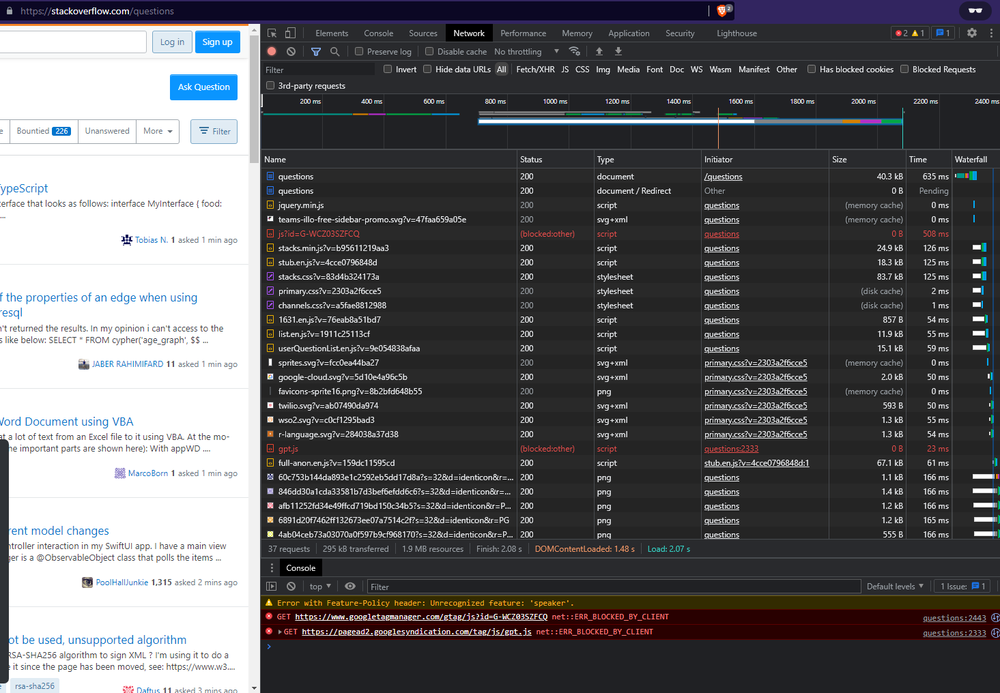
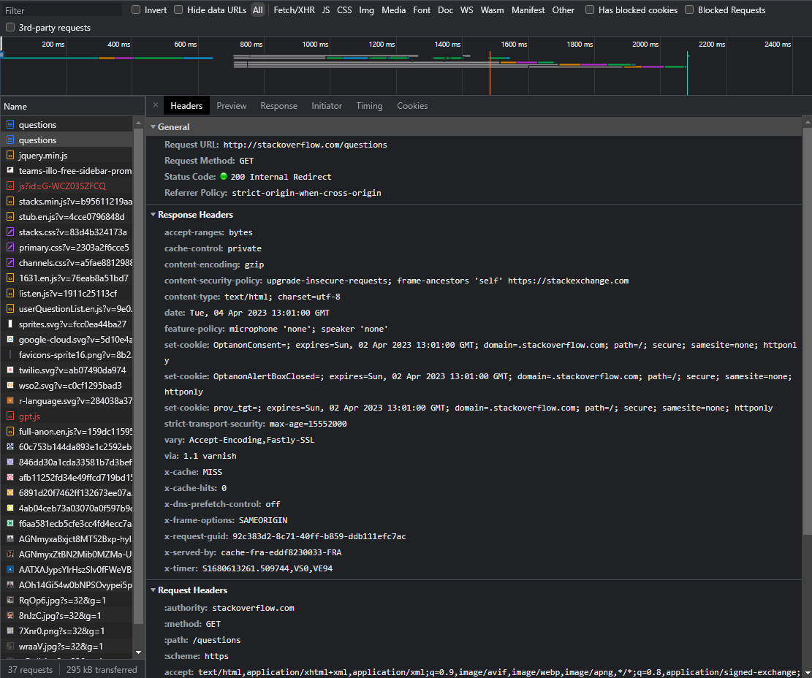
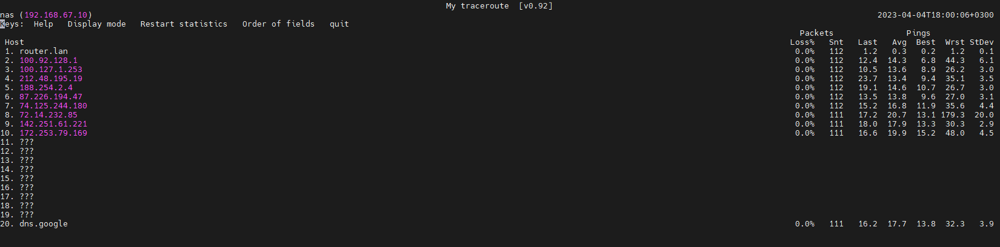

### 06. Компьютерные сети. Лекция 1
1. Подключаемся к Stackoverflow через telnet:
    ```commandline
    vagrant@vagrant:~$ telnet stackoverflow.com 80
    Trying 151.101.193.69...
    Connected to stackoverflow.com.
    Escape character is '^]'.
    GET /questions HTTP/1.0
    HOST: stackoverflow.com
    
    HTTP/1.1 403 Forbidden
    Connection: close
    Content-Length: 1918
    Server: Varnish
    Retry-After: 0
    Content-Type: text/html
    Accept-Ranges: bytes
    Date: Tue, 04 Apr 2023 12:44:27 GMT
    Via: 1.1 varnish
    X-Served-By: cache-fra-eddf8230048-FRA
    X-Cache: MISS
    X-Cache-Hits: 0
    X-Timer: S1680612268.978091,VS0,VE1
    X-DNS-Prefetch-Control: off
    ...
    ```
    Получили в ответ ошибку 403 - доступ запрещён. В подробностях написано, что доступ с нашего IP закрыт:
    ```html
                    <div class="msg">
                            <h1>Access Denied</h1>
                            <p>This IP address (178.66.156.96) has been blocked from access to our services. If you believe this to be in error, please contact us at <a href="mailto:team@stackexchange.com?Subject=Blocked%20178.66.156.96%20(Request%20ID%3A%20699801138-FRA)">team@stackexchange.com</a>.</p>
                            <p>When contacting us, please include the following information in the email:</p>
                            <p>Method: block</p>
                            <p>XID: 699801138-FRA</p>
                            <p>IP: 178.66.156.96</p>
                            <p>X-Forwarded-For: </p>
                            <p>User-Agent: </p>
    
                            <p>Time: Tue, 04 Apr 2023 12:44:27 GMT</p>
                            <p>URL: stackoverflow.com/questions</p>
                            <p>Browser Location: <span id="jslocation">(not loaded)</span></p>
                    </div>
    
    ```
2. Запрос с помощью браузера:

Как видно, самым "тяжёлым" является запрос к основной странице /questions/. 
А первым всё же был запрос, который в списке числится вторым, с кодом 200 intrnal redirect, по результатам которого произошёл "апгрейд" соединения до безопасного (https):

3. Для определения текущего внешнего IP воспользуемся, например, удобным для работы в консоли сервисом [ifconfig.me](https//ifconfig.me):
   ```commandline
   vagrant@vagrant:~$ curl https://ifconfig.me/ip
   178.66.156.96
   ```
4. Этот IP адрес принадлежит компании "Ростелеком Северо-запад", AS8997:
   ```commandline
   vagrant@vagrant:~$ whois 178.66.156.96
   % This is the RIPE Database query service.
   % The objects are in RPSL format.
   %
   % The RIPE Database is subject to Terms and Conditions.
   % See http://www.ripe.net/db/support/db-terms-conditions.pdf
   
   % Note: this output has been filtered.
   %       To receive output for a database update, use the "-B" flag.
   
   % Information related to '178.66.156.0 - 178.66.157.255'
   
   % Abuse contact for '178.66.156.0 - 178.66.157.255' is 'abuse@rt.ru'
   
   inetnum:        178.66.156.0 - 178.66.157.255
   netname:        RU-RTK-NAT-SZL
   descr:          PJSC "Rostelecom" North-West Region
   descr:          14A, Sinopskaya emb., 191167, Saint-Petersburg, Russia
   country:        RU
   admin-c:        RCR3-RIPE
   tech-c:         RCR3-RIPE
   status:         ASSIGNED PA
   mnt-by:         AS8997-MNT
   mnt-lower:      AS8997-MNT
   mnt-domains:    AS8997-MNT
   mnt-routes:     AS8997-MNT
   created:        2021-11-11T11:42:19Z
   last-modified:  2021-11-11T11:42:19Z
   source:         RIPE
   
   role:           ru.spbnit contact role
   address:        OJSC Rostelecom
   address:        Macro-regional branch Northwest
   address:        14/26 Gorokhovaya str. (26 Bolshaya Morskaya str.)
   address:        191186, St.-Petersburg
   address:        Russia
   phone:          +7 812 595 45 56
   remarks:        --------------------------------------------
   admin-c:        AA728-RIPE
   admin-c:        VE128-RIPE
   tech-c:         AA728-RIPE
   tech-c:         VE128-RIPE
   tech-c:         TR4627-RIPE
   tech-c:         RT8555-RIPE
   nic-hdl:        RCR3-RIPE
   remarks:        --------------------------------------------
   remarks:        General questions: ip-noc(at)nw.rt.ru
   remarks:        Routing & peering: ip-noc(at)nw.rt.ru
   remarks:        --------------------------------------------
   abuse-mailbox:  abuse@rt.ru
   mnt-by:         AS8997-MNT
   created:        2002-09-04T09:29:24Z
   last-modified:  2022-10-26T15:50:20Z
   source:         RIPE # Filtered
   
   % Information related to '178.66.0.0/16AS12389'
   
   route:          178.66.0.0/16
   descr:          Rostelecom networks
   origin:         AS12389
   mnt-by:         ROSTELECOM-MNT
   created:        2018-10-18T10:19:19Z
   last-modified:  2018-10-18T10:19:19Z
   source:         RIPE # Filtered
   
   % This query was served by the RIPE Database Query Service version 1.106 (SHETLAND)
   
   ```
5.  Маршрут до google DNS:
   ```commandline
   vagrant@vagrant:~$ traceroute -A 8.8.8.8
   traceroute to 8.8.8.8 (8.8.8.8), 30 hops max, 60 byte packets
    1  router.lan (192.168.67.1) [*]  0.265 ms  0.275 ms  0.315 ms
    2  100.92.128.1 (100.92.128.1) [*]  20.340 ms  27.570 ms  27.504 ms
    3  100.127.1.253 (100.127.1.253) [*]  28.464 ms  28.342 ms  28.417 ms
    4  212.48.195.19 (212.48.195.19) [AS12389]  27.484 ms  28.092 ms  27.416 ms
    5  188.254.2.4 (188.254.2.4) [AS12389]  34.755 ms  34.692 ms 188.254.2.6 (188.254.2.6) [AS12389]  33.436 ms
    6  87.226.194.47 (87.226.194.47) [AS12389]  30.880 ms  17.902 ms  19.600 ms
    7  74.125.244.180 (74.125.244.180) [AS15169]  18.462 ms  20.166 ms  19.994 ms
    8  142.251.61.219 (142.251.61.219) [AS15169]  20.197 ms 216.239.48.163 (216.239.48.163) [AS15169]  19.029 ms 72.14.232.85 (72.14.232.85) [AS15169]  19.920 ms
    9  142.251.61.221 (142.251.61.221) [AS15169]  17.917 ms 142.250.56.129 (142.250.56.129) [AS15169]  20.649 ms 142.251.61.221 (142.251.61.221) [AS15169]  19.769 ms
   10  * * *
   11  * * *
   12  * * *
   13  * * *
   14  * * *
   15  * * *
   16  * * dns.google (8.8.8.8) [AS15169/AS263411]  21.582 ms
   
   ```
   Видим, что пакет проходит через сети из `AS12389` и `AS15169` , принадлежащие Ростелеком и Google соответственно.
6. Утилта `mtr`. Видим, что наибольшая средняя задержка до хоста 72.14.232.85.

7. Утилита `dig`. Адреса серверов dns.google:
   ```commandline
   vagrant@vagrant:~$ dig dns.google
   
   ; <<>> DiG 9.16.1-Ubuntu <<>> dns.google
   ;; global options: +cmd
   ;; Got answer:
   ;; ->>HEADER<<- opcode: QUERY, status: NOERROR, id: 57054
   ;; flags: qr rd ra; QUERY: 1, ANSWER: 2, AUTHORITY: 0, ADDITIONAL: 1
   
   ;; OPT PSEUDOSECTION:
   ; EDNS: version: 0, flags:; udp: 65494
   ;; QUESTION SECTION:
   ;dns.google.                    IN      A
   
   ;; ANSWER SECTION:
   dns.google.             787     IN      A       8.8.8.8
   dns.google.             787     IN      A       8.8.4.4
   
   ;; Query time: 0 msec
   ;; SERVER: 127.0.0.53#53(127.0.0.53)
   ;; WHEN: Tue Apr 04 15:37:32 UTC 2023
   ;; MSG SIZE  rcvd: 71
   
   ```
8. Обратные записи. Видим, что обоим серверам соответсвует запись `dns.google`:
   ```commandline
   vagrant@vagrant:~$ dig -x 8.8.4.4
   
   ; <<>> DiG 9.16.1-Ubuntu <<>> -x 8.8.4.4
   ;; global options: +cmd
   ;; Got answer:
   ;; ->>HEADER<<- opcode: QUERY, status: NOERROR, id: 32131
   ;; flags: qr rd ra; QUERY: 1, ANSWER: 1, AUTHORITY: 0, ADDITIONAL: 1
   
   ;; OPT PSEUDOSECTION:
   ; EDNS: version: 0, flags:; udp: 65494
   ;; QUESTION SECTION:
   ;4.4.8.8.in-addr.arpa.          IN      PTR
   
   ;; ANSWER SECTION:
   4.4.8.8.in-addr.arpa.   86400   IN      PTR     dns.google.
   
   ;; Query time: 388 msec
   ;; SERVER: 127.0.0.53#53(127.0.0.53)
   ;; WHEN: Tue Apr 04 15:40:07 UTC 2023
   ;; MSG SIZE  rcvd: 73
   
   vagrant@vagrant:~$ dig -x 8.8.8.8
   
   ; <<>> DiG 9.16.1-Ubuntu <<>> -x 8.8.8.8
   ;; global options: +cmd
   ;; Got answer:
   ;; ->>HEADER<<- opcode: QUERY, status: NOERROR, id: 18761
   ;; flags: qr rd ra; QUERY: 1, ANSWER: 1, AUTHORITY: 0, ADDITIONAL: 1
   
   ;; OPT PSEUDOSECTION:
   ; EDNS: version: 0, flags:; udp: 65494
   ;; QUESTION SECTION:
   ;8.8.8.8.in-addr.arpa.          IN      PTR
   
   ;; ANSWER SECTION:
   8.8.8.8.in-addr.arpa.   81690   IN      PTR     dns.google.
   
   ;; Query time: 0 msec
   ;; SERVER: 127.0.0.53#53(127.0.0.53)
   ;; WHEN: Tue Apr 04 15:40:19 UTC 2023
   ;; MSG SIZE  rcvd: 73
   
   ```